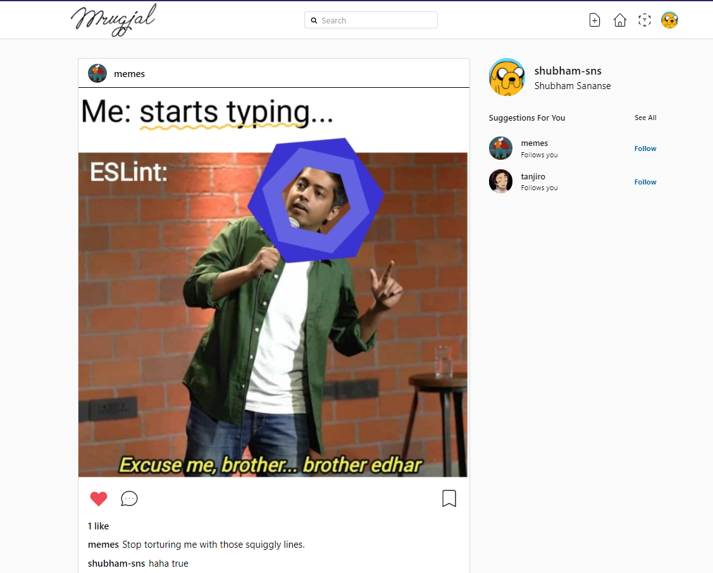

### Mrugjal

## Introduction

The application was built with the purpose of using some technologies like firebase/firestore, firbase/auth, cloudinary, tailwindcss.

Demo live at: [mrugjal.vercel.app](https://mrugjal.vercel.app/)

## Features

- Signin/signup
- Profile page
- Post page
- Timeline
- Suggestions
- Search
- Explore posts
- Add/delete posts
- Comment/like/save posts

## Codebase

### Technologies

The entire codebase consists in **Javascript**

Here is a list of technologies used:

- **React**: Front-end framework
- **Tailwind**: CSS framework
- **Firebase**: Cloud database/auth provider
- **Cloudinary**: Cloud image management

## Acknowledgments

This project is mimicking the famous [Instabram by Facebook](https://www.instagram.com/) web application with no intent of realeasing or advertising the use of the content in this repo. Being just a demo app!!!

Project takes different approch than [@karlhadwen](https://github.com/karlhadwen)'s base instagram build in terms of artitecture and choice of libraries, also comes with addition of new features and code changes.
